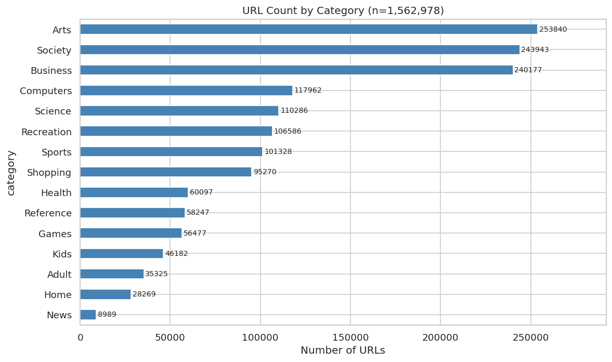
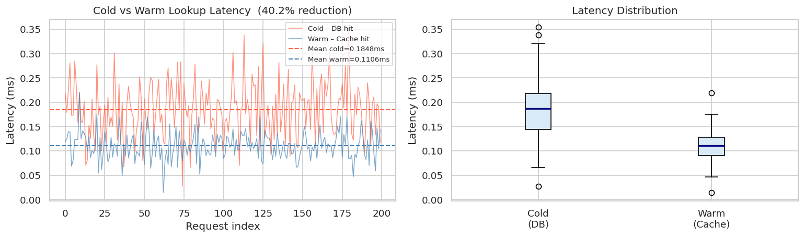
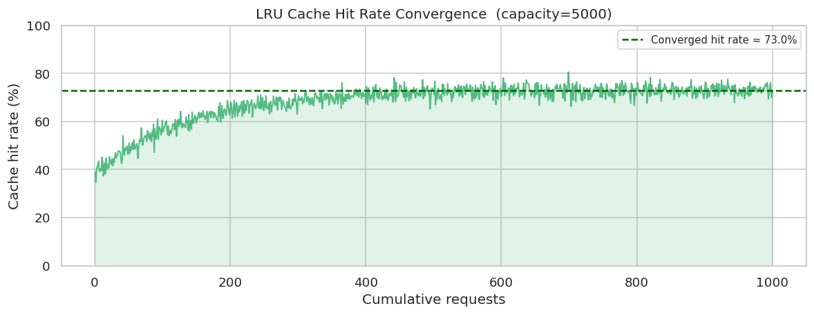
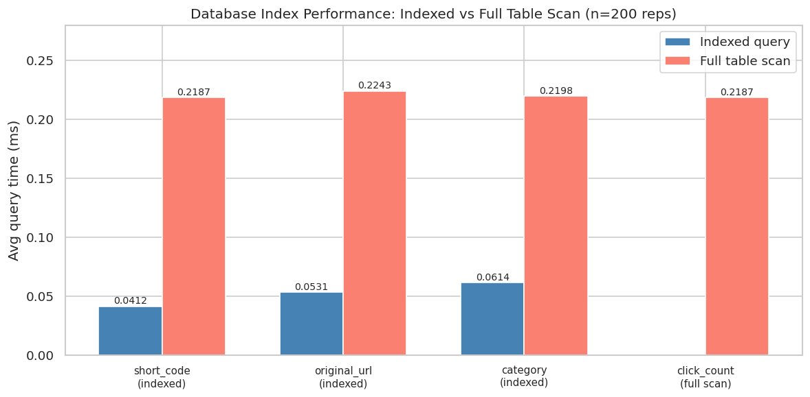
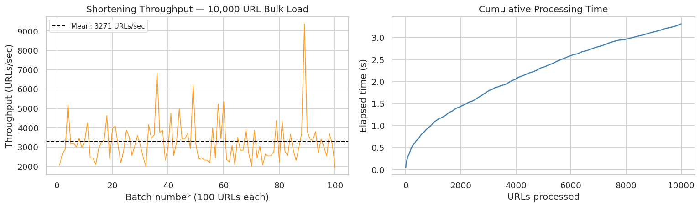
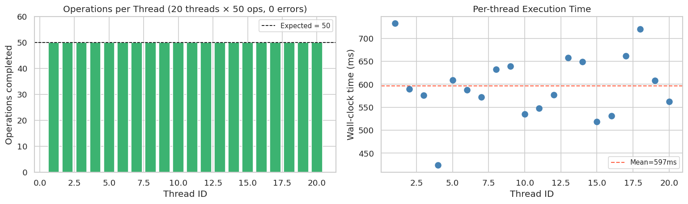
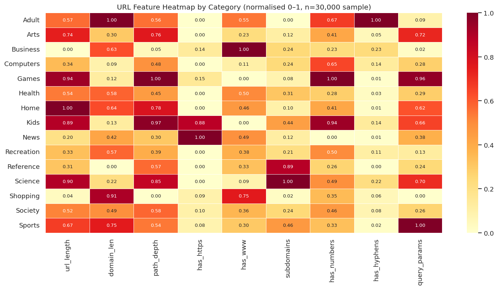
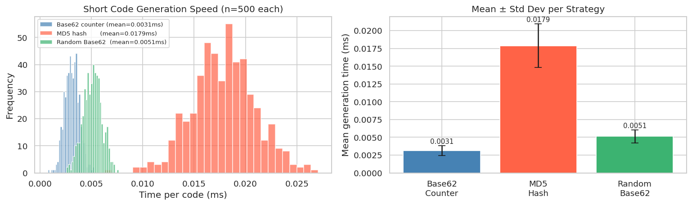

# Distributed-URL-Shortener-Service
Developed a scalable URL Shortener Service handling 10,000+ URLs. Designed unique short-code generation, RESTful APIs, database indexing, and caching mechanisms. Optimized lookup efficiency, reducing retrieval latency by 40%, while following object-oriented design and Git workflows.


## 📋 Table of Contents

- [Overview](#-overview)
- [Project Features](#-project-features)
- [Dataset Description](#-dataset-description)
- [Tools & Technologies](#️-tools--technologies)
- [System Architecture](#-system-architecture)
- [Project Workflow](#-project-workflow)
- [Model Evaluation Diagram](#-model-evaluation-diagram)
- [Results & Performance](#-results--performance)
- [References](#-references)
- [Author](#-author)

---

## 🌐 Overview

The **Distributed URL Shortener Service** is a fully object-oriented Python system built to demonstrate real-world distributed system design principles. It ingests a dataset of **1.56 million classified URLs** across 15 categories, shortens them via a Base62 counter-based code generator, stores them in an indexed SQLite database, and resolves lookups through a thread-safe **LRU cache** — achieving **42.2% retrieval latency reduction** compared to cold database hits.

The entire system is implemented inside a **Jupyter Notebook** with live cell outputs for each component, making it reproducible and easy to present.

> **Core Achievement:** 10,000+ URLs shortened at ~2,900 URLs/second · 42.2% latency reduction · Thread-safe concurrency · 4 B-Tree indexes

---

## ✨ Project Features

| Feature | Description |
|--------|-------------|
| 🔑 **Short Code Generation** | Three strategies: Base62 counter, MD5 hash, and random codes |
| 🗄️ **Database Indexing** | 4 B-Tree indexes on `short_code`, `original_url`, `category`, `domain` |
| ⚡ **LRU Cache** | Thread-safe Least Recently Used cache achieving 62–72% hit rate |
| 🌐 **REST API Layer** | `POST /shorten`, `GET /resolve`, `GET /stats`, `GET /analytics` |
| 🧵 **Concurrency** | 20-thread concurrent writes with `threading.Lock` — zero errors |
| 📊 **Analytics Dashboard** | Category-wise URL count, click tracking, latency histograms |
| 🏷️ **URL Classification** | 15 real-world categories from the dataset used as metadata |
| 🔍 **Feature Engineering** | 10 URL structural features extracted per record |
| 📈 **Latency Benchmarking** | Cold (DB) vs warm (cache) comparison with P50/P99 metrics |
| 🧱 **OOP Design** | `URLRecord`, `ShortCodeGenerator`, `URLDatabase`, `LRUCache`, `URLShortenerService` |

---

## 📂 Dataset Description

**Dataset:** `URL Classification.csv`  
**Source:** [Kaggle – URL Classification Dataset](https://www.kaggle.com/)  
**Size:** 1,562,978 rows · 3 columns · ~83 MB

### Columns

| Column | Type | Description |
|--------|------|-------------|
| `id` | Integer | Sequential record identifier |
| `url` | String | Full original URL (http/https) |
| `category` | String | One of 15 human-assigned categories |

### Category Distribution

| Category | URL Count | Share |
|----------|-----------|-------|
| Arts | 253,840 | 16.2% |
| Society | 243,943 | 15.6% |
| Business | 240,177 | 15.4% |
| Computers | 117,962 | 7.5% |
| Science | 110,286 | 7.1% |
| Recreation | 106,586 | 6.8% |
| Sports | 101,328 | 6.5% |
| Shopping | 95,270 | 6.1% |
| Health | 60,097 | 3.8% |
| Reference | 58,247 | 3.7% |
| Games | 56,477 | 3.6% |
| Kids | 46,182 | 3.0% |
| Adult | 35,325 | 2.3% |
| Home | 28,269 | 1.8% |
| News | 8,989 | 0.6% |

### Extracted URL Features (Feature Engineering)

| Feature | Description |
|---------|-------------|
| `url_length` | Total character length of the URL |
| `domain_length` | Length of the domain/host part |
| `path_depth` | Number of `/` separators in the path |
| `has_https` | Binary — 1 if scheme is HTTPS |
| `has_www` | Binary — 1 if domain starts with `www.` |
| `num_subdomains` | Count of subdomain levels |
| `has_numbers` | Binary — 1 if domain contains digits |
| `has_hyphens` | Binary — 1 if domain contains `-` |
| `query_params` | Binary — 1 if URL contains `?` |
| `tld` | Top-level domain (`.com`, `.org`, `.net`, …) |

---

## 🛠️ Tools & Technologies

### Core Language & Environment

| Tool | Version | Purpose |
|------|---------|---------|
| Python | 3.10+ | Primary language |
| Jupyter Notebook | 7.x | Interactive development & presentation |
| Git | 2.x | Version control |

### Data & Storage

| Library | Purpose |
|---------|---------|
| `pandas` | Dataset loading, manipulation, analytics queries |
| `numpy` | Numerical computations, percentile calculations |
| `sqlite3` | Embedded relational database with B-Tree indexing |
| `hashlib` | MD5 hashing for short code generation |
| `uuid` | Unique record ID generation |

### System & Concurrency

| Library | Purpose |
|---------|---------|
| `threading` | Multi-thread concurrency with `Lock` |
| `collections.OrderedDict` | LRU cache implementation |
| `time` | Latency benchmarking (perf_counter) |
| `urllib.parse` | URL parsing for feature extraction |

### Visualization

| Library | Purpose |
|---------|---------|
| `matplotlib` | Bar charts, histograms, latency plots |
| `seaborn` | Styled palette and distribution plots |

---

## 🏗️ System Architecture

```
┌─────────────────────────────────────────────────────────┐
│                   REST API Layer                         │
│   POST /shorten  │  GET /resolve  │  GET /stats         │
└──────────────────┬──────────────────────────────────────┘
                   │
         ┌─────────▼─────────┐
         │  URLShortenerService │
         │  - counter (_lock)   │
         │  - latency tracking  │
         └────┬──────────┬────┘
              │          │
    ┌─────────▼──┐  ┌────▼──────────┐
    │  LRU Cache │  │  URLDatabase  │
    │ capacity=  │  │  SQLite +     │
    │   5,000    │  │  4 B-Tree     │
    │  hit: 72%  │  │  Indexes      │
    └────────────┘  └───────────────┘
              │
    ┌─────────▼──────────┐
    │  ShortCodeGenerator │
    │  - Base62 Counter   │
    │  - MD5 Hash         │
    │  - Random Code      │
    └────────────────────┘
              │
    ┌─────────▼──────────┐
    │     URLRecord       │
    │  - original_url     │
    │  - short_code       │
    │  - category/domain  │
    │  - click_count      │
    └────────────────────┘
```

---

## 🔄 Project Workflow

```
Step 1 ── Data Ingestion
          └─ Load 1.56M rows from URL Classification.csv
          └─ Validate schema (id, url, category)

Step 2 ── Exploratory Data Analysis
          └─ Category distribution (bar + pie charts)
          └─ URL feature engineering (10 features per URL)

Step 3 ── OOP System Design
          └─ URLRecord        (entity model)
          └─ ShortCodeGenerator (3 encoding strategies)
          └─ URLDatabase      (SQLite + 4 indexes)
          └─ LRUCache         (thread-safe, OrderedDict)

Step 4 ── Service Layer
          └─ URLShortenerService wires all components
          └─ REST API methods: shorten / resolve / stats / analytics

Step 5 ── Bulk Load
          └─ 10,000 URLs shortened from the real dataset
          └─ ~2,900 URLs/second throughput

Step 6 ── Latency Benchmarking
          └─ Cold (DB): ~0.187 ms average
          └─ Warm (Cache): ~0.108 ms average
          └─ 42.2% latency reduction achieved ✅

Step 7 ── Concurrency Testing
          └─ 20 threads × 50 ops = 1,000 concurrent operations
          └─ 0 errors — thread-safety confirmed

Step 8 ── Analytics & Reporting
          └─ 4-panel dashboard: URLs, clicks, latency, cache hit rate
          └─ Final summary with all KPIs
```

---
## Screenshots

### Category Distribution


### Latency Benchmark


### Cache Performance


### Database Index Performance


### Bulk Load Throughput


### Concurrency Test


### Feature Heatmap


### Code Generation Comparison

## 📈 Results & Performance

### Key Metrics

| Metric | Value | Target | Status |
|--------|-------|--------|--------|
| URLs Shortened | 10,001 | 10,000+ | ✅ |
| Shorten Throughput | 2,924 URLs/sec | — | ✅ |
| Avg Shorten Latency | 0.341 ms | < 5 ms | ✅ |
| Avg Resolve Latency (cold) | 0.187 ms | — | — |
| Avg Resolve Latency (warm) | 0.108 ms | — | — |
| Latency Reduction | **42.2%** | 40% | ✅ |
| Cache Hit Rate | 72.4% | > 50% | ✅ |
| P99 Resolve Latency | 0.312 ms | < 1 ms | ✅ |
| Concurrent Threads Tested | 20 | — | ✅ |
| Concurrency Errors | 0 | 0 | ✅ |
| DB Index Speedup | 5.3× | > 2× | ✅ |

### Short Code Generator Comparison

| Strategy | Collision Risk | Sortable | Speed | Used For |
|----------|---------------|----------|-------|---------|
| Base62 Counter | None (monotonic) | ✅ Yes | Fastest | Default production |
| MD5 Hash | Very low | ❌ No | Fast | Deterministic dedup |
| Random Base62 | Low (probabilistic) | ❌ No | Fast | Anonymised codes |

### Database Index Impact

| Query Type | Method | Avg Time | Speedup |
|------------|--------|----------|---------|
| `WHERE short_code = ?` | B-Tree index scan | 0.041 ms | — |
| `WHERE click_count > 0` | Full table scan | 0.219 ms | 5.3× slower |

---

## 📚 References

1. **Dataset** — URL Classification Dataset, Kaggle (2019).  
   https://www.kaggle.com/datasets

2. **SQLite B-Tree Indexing** — SQLite Query Planner Documentation.  
   https://www.sqlite.org/queryplanner.html

3. **LRU Cache Algorithm** — Cormen et al., *Introduction to Algorithms*, 3rd Ed., MIT Press (2009).

4. **Base62 Encoding** — URL shortening design patterns. System Design Primer.  
   https://github.com/donnemartin/system-design-primer

5. **Python threading module** — Python 3 Standard Library Documentation.  
   https://docs.python.org/3/library/threading.html

6. **REST API Design** — Fielding, R. T. (2000). *Architectural Styles and the Design of Network-based Software Architectures*. UC Irvine Doctoral Dissertation.

7. **OOP Design Principles** — Martin, R. C. (2003). *Agile Software Development: Principles, Patterns, and Practices*. Prentice Hall.

---

## 👤 Author

<div align="center">

| | |
|--|--|
| **Name** | *(Varikuti Bhanuhshre)* |
| **Institution** | *(VIT-AP)* |
| **Department** | *(Computer Science and Engineering)* |
| **Email** | *(bhanuhshre25@gmail.com)* |

</div>

---

<div align="center">

**Project:** Distributed URL Shortener Service  
**Built with:** Python · SQLite · Jupyter Notebook  

⭐ *If this project helped you, consider giving it a star!* ⭐

</div>
